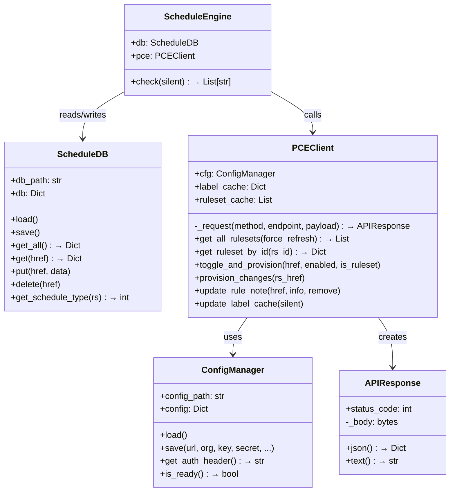
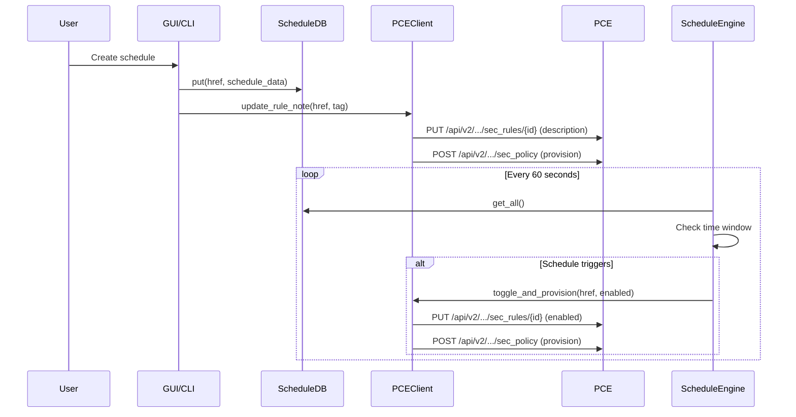

# Architecture & Specifications — Illumio Rule Scheduler

🌐 [English](Architecture_en.md) | [繁體中文](Architecture_zh.md)

---

## Directory Structure

```
illumio_Rule-Scheduler/
├── illumio_scheduler.py      # Entry point: argument parsing, mode selection
├── config.json               # PCE connection & app settings
├── config.json.example       # Example config with all fields documented
├── rule_schedules.json       # Local schedule database (auto-generated)
├── src/
│   ├── __init__.py            # Package marker
│   ├── core.py                # Core engine: 5 classes, all API logic
│   ├── cli_ui.py              # CLI interactive interface
│   ├── gui_ui.py              # Flask Web GUI (SPA with embedded HTML/CSS/JS)
│   └── i18n.py                # Internationalization string tables (EN/ZH)
├── docs/                      # Documentation (EN + ZH bilingual)
└── deploy/
    ├── deploy_windows.ps1     # Windows NSSM service installer
    └── illumio-scheduler.service  # Linux systemd unit file
```

---

## Core Classes (src/core.py)

The entire engine is contained in a single file with five classes:



### 1. ConfigManager

**Responsibility**: Read/write `config.json`.

- Loads PCE credentials and app settings from disk
- Generates the HTTP Basic Auth header (`base64(api_key:api_secret)`)
- Saves language preference

### 2. ScheduleDB

**Responsibility**: Manage the local `rule_schedules.json` file.

- CRUD operations for schedules keyed by rule/ruleset HREF
- `get_schedule_type(rs)` determines if a ruleset has a self-schedule (★), child-schedule (●), or none

### 3. APIResponse

**Responsibility**: Lightweight HTTP response wrapper (replaces `requests.Response`).

- Wraps `status_code` and `body` from `urllib.request`
- Safely handles empty bodies (returns `{}` for 204 No Content)

### 4. PCEClient

**Responsibility**: All Illumio REST API communication.

- Uses **only Python standard library** (`urllib.request`, `ssl`, `base64`)
- Caches labels, IP lists, services, and rulesets for performance
- Key methods:
  - `get_all_rulesets()` — GET `/sec_policy/draft/rule_sets?max_results=10000`
  - `toggle_and_provision()` — PUT to toggle `enabled`, then provision
  - `provision_changes()` — Dependency-aware provisioning via POST `/sec_policy`
  - `update_rule_note()` — Appends/removes schedule tags in `description`

### 5. ScheduleEngine

**Responsibility**: Core scheduling logic.

- Iterates all schedules and compares current time
- For **recurring**: checks day-of-week and time window → toggles `enabled`
- For **one-time**: checks if expired → disables and removes schedule
- Returns a log of actions taken

---

## Data Flow



---

## API Endpoints Used

| Action | Method | Endpoint |
|--------|--------|----------|
| List all rulesets | GET | `/api/v2/orgs/{org}/sec_policy/draft/rule_sets?max_results=10000` |
| Get single ruleset | GET | `/api/v2/orgs/{org}/sec_policy/draft/rule_sets/{id}` |
| Update rule | PUT | `/api/v2/orgs/{org}/sec_policy/draft/rule_sets/{rs_id}/sec_rules/{rule_id}` |
| Update ruleset | PUT | `/api/v2/orgs/{org}/sec_policy/draft/rule_sets/{rs_id}` |
| Provision changes | POST | `/api/v2/orgs/{org}/sec_policy` |
| List labels | GET | `/api/v2/orgs/{org}/labels?max_results=10000` |
| List IP lists | GET | `/api/v2/orgs/{org}/sec_policy/draft/ip_lists?max_results=10000` |
| List services | GET | `/api/v2/orgs/{org}/sec_policy/draft/services?max_results=10000` |

---

## Provisioning Process

Illumio uses a two-phase commit model:

1. **Draft Phase** — All changes are made to draft objects (PUT).
2. **Provision Phase** — Changes are committed via `POST /sec_policy` with a `change_subset`.

The tool implements **dependency-aware provisioning**:

```python
# 1. Discover parent ruleset from rule HREF
rs_href = extract_ruleset_href(rule_href)

# 2. Build change_subset with the ruleset
payload = {
    "update_description": "Illumio Scheduler toggle",
    "change_subset": {
        "rule_sets": [{"href": rs_href}]
    }
}

# 3. POST to provision
self._api_post(f"/orgs/{org_id}/sec_policy", payload)
```

---

## Extension Guide

### Adding a New Schedule Type

1. Define the new type in `ScheduleDB.put()` data format.
2. Add checking logic in `ScheduleEngine.check()`.
3. Update the GUI modal and CLI menu to support the new type.
4. Add i18n strings in `src/i18n.py`.

### Adding a New API Integration

1. Add a new method to `PCEClient` following the existing pattern:
   ```python
   def my_new_api_call(self, param):
       return self._api_get(f"/orgs/{self.cfg.config['org_id']}/new_endpoint")
   ```
2. The `_request()` method handles auth, SSL, and error handling automatically.

### Adding a New Language

1. Add a new language block in `src/i18n.py`:
   ```python
   'ja': {  # Japanese
       'app_title': 'Illumio ルールスケジューラー',
       ...
   }
   ```
2. Set `"lang": "ja"` in `config.json`.

---

## Related Documentation

| Document | Description |
|----------|-------------|
| [Overview](README_en.md) | Program introduction and features |
| [User Manual](User_Manual_en.md) | Step-by-step operating instructions |
| [API Cookbook](API_Cookbook_en.md) | Python examples for Illumio API automation |
