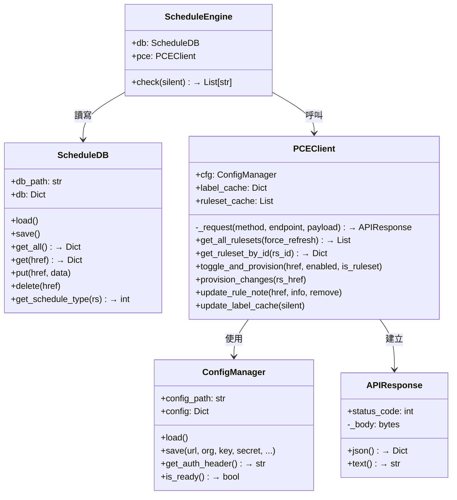
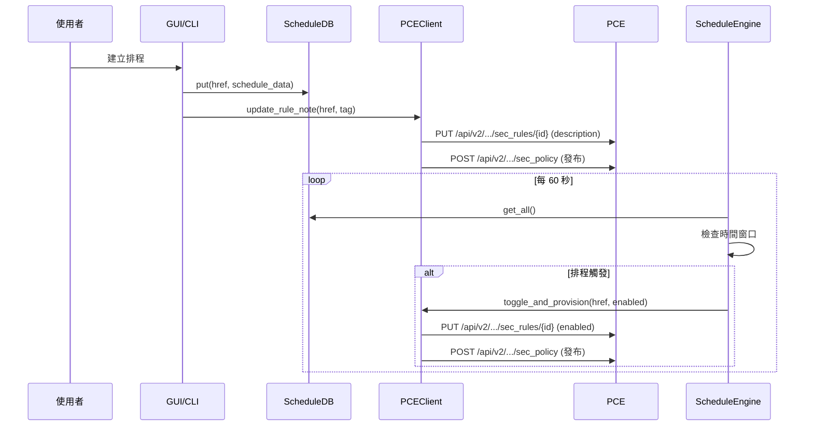

# 程式架構與規格 — Illumio Rule Scheduler

🌐 [English](Architecture_en.md) | [繁體中文](Architecture_zh.md)

---

## 目錄結構

```
illumio_Rule-Scheduler/
├── illumio_scheduler.py      # 進入點：參數解析、模式選擇
├── config.json               # PCE 連線與應用設定
├── config.json.example       # 含所有欄位的範例設定
├── rule_schedules.json       # 本地排程資料庫（自動產生）
├── src/
│   ├── __init__.py            # 套件標記
│   ├── core.py                # 核心引擎：5 個類別，所有 API 邏輯
│   ├── cli_ui.py              # CLI 互動介面
│   ├── gui_ui.py              # Flask Web GUI（內嵌 HTML/CSS/JS 的 SPA）
│   └── i18n.py                # 國際化字串表（EN/ZH）
├── docs/                      # 文件（EN + ZH 雙語）
└── deploy/
    ├── deploy_windows.ps1     # Windows NSSM 服務安裝腳本
    └── illumio-scheduler.service  # Linux systemd 單元檔
```

---

## 核心類別 (src/core.py)

整個引擎包含在單一檔案中，共五個類別：



### 1. ConfigManager

**職責**：讀寫 `config.json`。

- 從磁碟載入 PCE 連線資訊和應用設定
- 產生 HTTP Basic Auth 標頭（`base64(api_key:api_secret)`）
- 儲存語言偏好設定

### 2. ScheduleDB

**職責**：管理本地 `rule_schedules.json` 檔案。

- 以 Rule/RuleSet HREF 為 Key 的 CRUD 操作
- `get_schedule_type(rs)` 判斷規則集是否有自身排程 (★)、子規則排程 (●)、或無排程

### 3. APIResponse

**職責**：輕量 HTTP 回應封裝（取代 `requests.Response`）。

- 封裝 `urllib.request` 回傳的 `status_code` 和 `body`
- 安全處理空 body（204 No Content 回傳 `{}`）

### 4. PCEClient

**職責**：所有 Illumio REST API 通訊。

- **僅使用 Python 標準函式庫**（`urllib.request`、`ssl`、`base64`）
- 快取 Labels、IP Lists、Services 和 RuleSets 以提升效能
- 關鍵方法：
  - `get_all_rulesets()` — GET `/sec_policy/draft/rule_sets?max_results=10000`
  - `toggle_and_provision()` — PUT 切換 `enabled` 後發布
  - `provision_changes()` — 透過 POST `/sec_policy` 進行依賴感知發布
  - `update_rule_note()` — 在 `description` 附加/移除排程標籤

### 5. ScheduleEngine

**職責**：核心排程邏輯。

- 迭代所有排程，比對當前時間
- **循環排程**：檢查星期和時間窗口 → 切換 `enabled`
- **一次性到期**：檢查是否過期 → 停用並移除排程
- 回傳動作日誌

---

## 資料流



---

## 使用的 API 端點

| 動作 | 方法 | 端點 |
|------|------|------|
| 列出所有規則集 | GET | `/api/v2/orgs/{org}/sec_policy/draft/rule_sets?max_results=10000` |
| 取得單一規則集 | GET | `/api/v2/orgs/{org}/sec_policy/draft/rule_sets/{id}` |
| 更新規則 | PUT | `/api/v2/orgs/{org}/sec_policy/draft/rule_sets/{rs_id}/sec_rules/{rule_id}` |
| 更新規則集 | PUT | `/api/v2/orgs/{org}/sec_policy/draft/rule_sets/{rs_id}` |
| 發布變更 | POST | `/api/v2/orgs/{org}/sec_policy` |
| 列出標籤 | GET | `/api/v2/orgs/{org}/labels?max_results=10000` |
| 列出 IP 清單 | GET | `/api/v2/orgs/{org}/sec_policy/draft/ip_lists?max_results=10000` |
| 列出服務 | GET | `/api/v2/orgs/{org}/sec_policy/draft/services?max_results=10000` |

---

## 發布流程

Illumio 採用兩階段提交模型：

1. **草稿階段 (Draft)** — 所有變更先對草稿物件執行 PUT。
2. **發布階段 (Provision)** — 透過 `POST /sec_policy` 搭配 `change_subset` 提交變更。

工具實作了**依賴感知發布**：

```python
# 1. 從 Rule HREF 找出父規則集
rs_href = extract_ruleset_href(rule_href)

# 2. 建立包含規則集的 change_subset
payload = {
    "update_description": "Illumio Scheduler toggle",
    "change_subset": {
        "rule_sets": [{"href": rs_href}]
    }
}

# 3. POST 發布
self._api_post(f"/orgs/{org_id}/sec_policy", payload)
```

---

## 擴展指南

### 新增排程類型

1. 在 `ScheduleDB.put()` 定義新類型的資料格式。
2. 在 `ScheduleEngine.check()` 加入檢查邏輯。
3. 更新 GUI Modal 和 CLI 選單支援新類型。
4. 在 `src/i18n.py` 新增國際化字串。

### 新增 API 整合

1. 在 `PCEClient` 中依照現有模式新增方法：
   ```python
   def my_new_api_call(self, param):
       return self._api_get(f"/orgs/{self.cfg.config['org_id']}/new_endpoint")
   ```
2. `_request()` 方法自動處理認證、SSL 和錯誤處理。

### 新增語言

1. 在 `src/i18n.py` 新增語言區塊：
   ```python
   'ja': {  # 日文
       'app_title': 'Illumio ルールスケジューラー',
       ...
   }
   ```
2. 在 `config.json` 設定 `"lang": "ja"`。

---

## 相關文件

| 文件 | 說明 |
|------|------|
| [功能總覽](README_zh.md) | 程式介紹與功能 |
| [操作手冊](User_Manual_zh.md) | 逐步操作指南 |
| [API 教學手冊](API_Cookbook_zh.md) | Python 直接呼叫 Illumio API 範例 |
